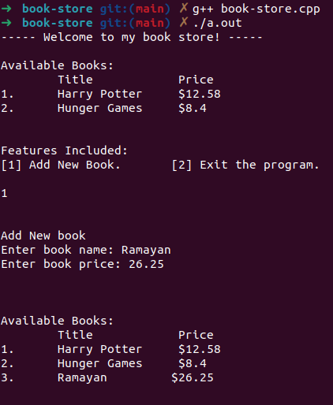
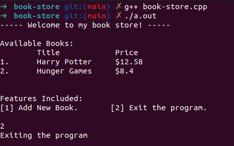

# Book store program in c++

### Introduction

A simple mini project of book store program in c++.

The books data are stored in book-store database file.

User can add new book in the library and it will update the book store.

 

### Running the program

- To compile, use the command: **g++ book-store.cpp**
- To run, use the command: **./a.out**

 

### Sample Output

 

